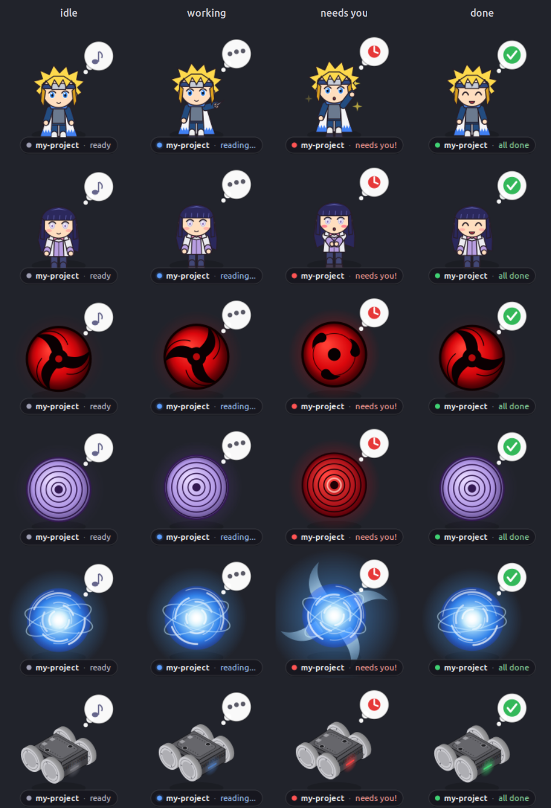
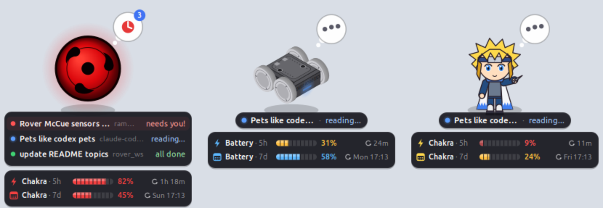

# claude-code-pets (Python)

A tiny animated desktop pet for [Claude Code](https://claude.com/claude-code) on Linux. It floats on top of your windows and shows, at a glance, whether Claude is **working**, **needs you**, or is **done**, so you never miss an approval prompt while you work in other windows.

> **Branches:** this `python` branch is the **Python version**. The [`main`](https://github.com/Rammeshadhav/claude-code-pets) branch has the same features as a single Rust binary (recommended).

## Installation

**You need:** a Linux desktop (X11, or GNOME/Wayland), [Claude Code](https://claude.com/claude-code), and Python 3.8+ with GTK 3 bindings.

```bash
# 1. dependencies
sudo apt install python3-gi python3-gi-cairo python3-cairo gir1.2-gtk-3.0   # Debian / Ubuntu
# sudo dnf install python3-gobject python3-cairo gtk3                       # Fedora
# sudo pacman -S python-gobject python-cairo gtk3                           # Arch

# 2. install
git clone -b python https://github.com/Rammeshadhav/claude-code-pets.git
cd claude-code-pets
./install.sh
```

That's it. Start Claude Code and the pet appears. To use the `claude-pet` command, make sure `~/.local/bin` is on your `PATH`.

### What `./install.sh` does

It's safe to re-run (to update):

| What | Where |
|---|---|
| Pet program | `~/.claude/pet/` |
| Hooks (merged in; your existing hooks are kept, and a backup is saved as `settings.json.bak-claude-pet`) | `~/.claude/settings.json` |
| Status line for plan usage (an existing status line keeps working through it) | `~/.claude/settings.json` |
| `/pet` slash command | `~/.claude/commands/pet.md` |
| `claude-pet` CLI | `~/.local/bin/claude-pet` |

### Uninstall

```bash
./uninstall.sh
```

This stops the pet and removes its hooks (keeping your others), gives back any status line you had before, and removes the `/pet` command, the CLI and `~/.claude/pet/`.

## What it looks like





> Unofficial community project. Not affiliated with Anthropic or OpenAI.

## Features

- **Live status** from Claude Code hooks: thinking, which tool is running (`reading…`, `editing…`, `running…`), needs your approval, finished, idle and asleep.
- **One pet for all terminals.** Every Claude Code session is tracked. The pet shows whichever needs you most, and with 2+ sessions a **session list** under it shows each one by its session title, with its status.
- **10 built-in pets:** chibi ninjas **Flash** and **Lavender**; the **Crimson Eye**, **Ripple Eye**, **Spiral Orb** and **Rover Miti** (smooth vector art); plus blob, cat, crab and ghost (pixel art).
- **Your own pets from any picture:** `claude-pet add NAME IMAGE` turns a PNG, JPEG or WebP into a pet, keeping the artwork exactly as it is.
- **Usage box:** your plan's 5-hour and weekly limits as themed meters (Chakra, Battery or Energy, depending on the pet), showing what's left and when each refills. Turn it on or off whenever you like.
- **Zero tokens.** The hooks print nothing, so nothing is added to Claude's context.
- **Never slows Claude down.** Hooks run async (Claude doesn't wait for them), and the pet updates about 20 ms after an event via inotify (no polling).
- **Light on resources.** Cached text, a frame rate that adapts to the state, and about 0.6 ms to draw a frame.
- Drag it anywhere (the position is remembered), resize it, and pick a pet from the right-click menu.

## Using it

### Reading the pet

| Bubble | Meaning | What to do |
|---|---|---|
| `•••` (animated) | Claude is working. The label shows the tool, e.g. `my-project · reading…` | Nothing, carry on |
| 🔴 red clock | **Claude needs you**: a permission prompt or a question | Go to the terminal |
| ✅ green check | Claude finished | Check the result, then click the pet to clear it |
| ♪ / `zzz` | Idle / asleep after 5 minutes | — |
| Blue number | That many sessions are busy at once | — |

### Several sessions at once

With two or more Claude Code sessions open, a list appears under the pet, most urgent first:

```
● Rover McCue sensors launch…   rammesh           needs you!   ← highlighted, pulsing
● Pets like codex pets          claude-code-pet   running...
● update README topics          rover_ws          all done
```

Each row is named by the **session title**, the same name Claude Code shows for the session (its automatic title, or the one you set with `/rename` or `--name`). The folder follows in grey, then the status. A brand-new session without a title yet shows your latest request instead. Click a row to clear its "all done", or click the pet to clear them all. Closed or killed terminals drop off the list within a few seconds. Turn the list off with right-click → **Show all sessions**.

### Pet reactions

Each pet also changes when Claude needs you. For example, the **Crimson Eye** switches from its blade pattern to three spinning tomoe, the **Ripple Eye** turns red with rings racing outward, the **Spiral Orb** grows spinning wind blades, and the **Rover Miti** rocks back and forth with its status light blinking red (it spins its wheels while working).

The chibi ninjas act out each state too. **Flash** raises a throwing knife while working, and crackles with lightning sparks and waves at you when he needs you. **Lavender** gets little sparkles of focus while working, and blushes, pressing her fingers together, when she needs you. Both grin when Claude is done, and close their eyes when asleep.

### Add your own pet from a picture

```bash
claude-pet add hero ~/Pictures/my-character.webp --meter Chakra
claude-pet add mycat ~/Pictures/cat.png
claude-pet remove mycat
```

Any PNG, JPEG or WebP works, and your artwork is kept exactly as it is:

- **Plain background** (white, a single color, or already transparent): it's cut out, so the character stands on your desktop like the other pets.
- **Busy background** (a painted scene): the picture is shown whole as a small rounded portrait card.

The pet then reacts through everything around the picture:

- an aura in the state's color: blue while working, pulsing red when Claude needs you, green when done
- a gentle breathing motion when idle, and a shake when Claude needs you
- a colored border on portrait cards
- twinkling stars when Claude finishes, and dimming when asleep
- the thought bubble, as with every pet

The usage meter takes its color from the artwork, and `--meter` sets its name (for example `Chakra` or `Mana`; the default is `Energy`). Prepared images live only on your machine in `~/.claude/pet/custom/`; nothing is uploaded or bundled.

### Usage limits

```
⚡ Chakra · 5h  ▰▰▰▰▰▰▰▰▱▱  82%   ↻ 1h 18m
▦ Chakra · 7d  ▰▰▰▰▰▱▱▱▱▱  45%   ↻ Sun 15:08
```

The box under the pet shows how much of your plan's **5-hour** and **weekly** limits is left, like a health bar, with a countdown to when each refills. The meter uses the pet's colour and name (Chakra for the eyes, the orb and the ninjas, Battery for the Miti, Energy for the pixel pets). It turns amber below 40% and pulses red below 15%. Turn it on or off from the right-click menu (**Show usage limits**) or with `claude-pet usage on|off`.

Claude Code only shares plan usage with status line commands, so the installer registers a small status line that records it. That status line shows the same numbers at the bottom of Claude Code (`5h 82% left (refills 1h 18m) · week 45% left …`). If you already had a status line, it keeps showing exactly as before, and the pet records usage behind it. Usage appears after Claude's first reply in a session and is only available on Pro and Max plans. With a custom status line set, Claude Code hides most of its footer keyboard hints; that's standard Claude Code behavior.

### Mouse

- **Drag:** move it (the position is remembered)
- **Click:** clear the green "done" check
- **Click a session row:** clear just that session's "done"
- **Right-click:** choose a pet, change the size, show or hide the session list and the usage box, clear finished sessions, or put the pet away

### Commands

In any terminal (or inside Claude Code as `! claude-pet …`, which uses no tokens):

```bash
claude-pet                  # toggle show/hide
claude-pet start | stop     # stop also disables auto-start until the next 'start'
claude-pet status
claude-pet species          # list pets
claude-pet species ripple
claude-pet size small       # small | medium (default) | large | 0.4–2.0
claude-pet usage off        # hide / show the usage box
claude-pet add NAME IMAGE   # make a pet from your own picture (--meter WORD)
claude-pet remove NAME      # delete an image pet
```

Inside Claude Code you can also type `/pet`, `/pet species spiral` and so on. This runs through the model, so it costs a few tokens.

## Configuration

`~/.claude/pet/config.json` is written by the menu and the CLI:

```json
{ "species": "crimson", "scale": 0.75, "show_list": true, "show_usage": true, "pos": [1600, 900] }
```

Environment variables:

- `CLAUDE_PET_DISABLE=1` stops hooks from auto-starting the pet in that shell
- `CLAUDE_PET_NATIVE=1` runs as a native Wayland client instead of XWayland (on GNOME it may then not stay on top)

## How it works

```
Claude Code ──hooks──▶ hook.py ──writes──▶ ~/.claude/pet/sessions/<session>.json
                                                  │ inotify
                                                  ▼
                                   pet.py (GTK window, cairo drawing)
```

| Hook | Pet state |
|---|---|
| `SessionStart` | idle (and launches the pet if it isn't running) |
| `UserPromptSubmit`, `PostToolUse` | working · thinking |
| `PreToolUse` | working · tool name |
| `Notification` (`permission_prompt`, `elicitation_dialog`) | needs you |
| `Notification` (`idle_prompt`), `Stop` | done |
| `SessionEnd` | session removed |

All hooks are registered with `"async": true`, so Claude never waits for them. Because async hooks can finish out of order, `hook.py` stamps each event with the time it started and never lets an older event overwrite a newer one. On the events between turns, it also reads the session title from the tail of the transcript (`customTitle` from `/rename`, else `aiTitle`).

Each session file also records the session's latest request (from `UserPromptSubmit`) and the PID of its Claude Code process. The pet drops a session as soon as that process is gone, so closed or killed terminals disappear within about 5 seconds even when no `SessionEnd` hook ran. With several sessions, the pet shows the most urgent one, in the order needs you > working > done > idle. A session stuck on "working" for 15 minutes counts as idle.

**Performance:** the hooks are async, so they add no delay to Claude, and each takes about 10 ms in the background. The pet shows a change about 20 ms after the event, and each frame takes about 0.6 ms to draw (text is cached and re-laid out only when it changes). While animating it uses about 5% of one core, most of it window compositing, and it drops to 2 fps when asleep. Memory is about 55 MB. Set `CLAUDE_PET_DEBUG=1` to log every state change with a timestamp.

## Add your own pet

- **Vector pet:** add a function `mypet(cr, cx, cy, R, t, state, asleep)` to `pet/vector_pets.py` that draws a ball of radius `R` at `(cx, cy)` with cairo, then register it in the `PETS` dict at the bottom.
- **Pixel pet:** add a 12×10 grid to `SPRITES` and a color set to `PALETTES` in `pet/pet.py`.
- **Picture pet:** no code needed; use `claude-pet add NAME IMAGE`.

Re-run `./install.sh` and pick the new pet from the menu.

## Troubleshooting

- **No pet appears:** run `claude-pet status`, then `claude-pet start`. If you'd stopped it with `claude-pet stop`, auto-start stays off until you `start` it again.
- **Session list is hard to read:** use `claude-pet size large`.
- **Pet is off-screen** (e.g. after unplugging a monitor): remove `"pos"` from `~/.claude/pet/config.json` and restart the pet.
- **Nothing happens over SSH:** the pet needs a desktop display.
- **Errors:** run `python3 ~/.claude/pet/pet.py` directly to see them.

## Credits & trademarks

- **Inspiration.** The idea comes from OpenAI's Codex Pets. The Crimson Eye, Ripple Eye and Spiral Orb, and the chibi ninjas Flash and Lavender, are original drawings inspired by the ninja-anime style, especially Masashi Kishimoto's *Naruto*, to whom credit and thanks go for the inspiration. They use their own names and designs, and contain no official artwork, names or symbols. The three-comma tomoe is a traditional Japanese motif.
- **Rover Miti** is a robot by Rover Robotics, drawn here as a tribute. "Rover Robotics" and "Rover Miti" are their trademarks.
- **Claude** and **Claude Code** are trademarks of Anthropic, and **Codex** is a trademark of OpenAI. This is an unofficial community project, not affiliated with or endorsed by either.
- **Your pictures.** The MIT license covers the code only. Pictures you add with `claude-pet add` are yours and never leave your machine; make sure you're allowed to use them.

## License

[MIT](LICENSE)
